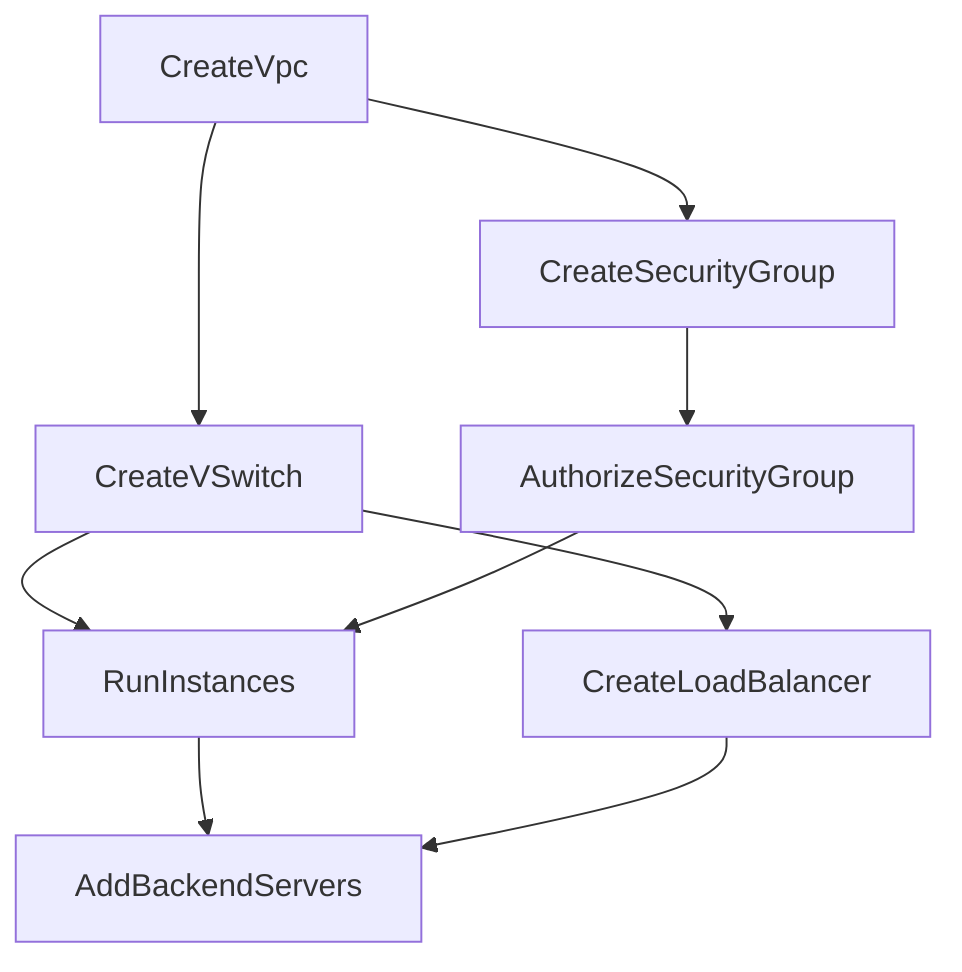
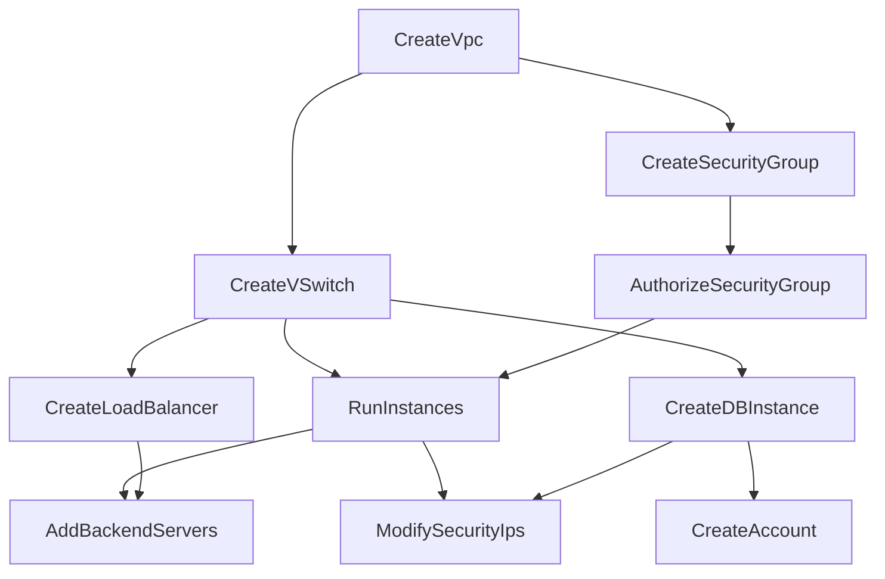
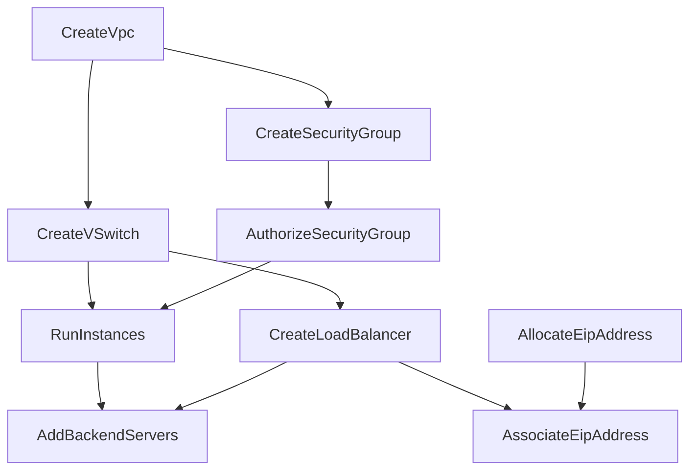
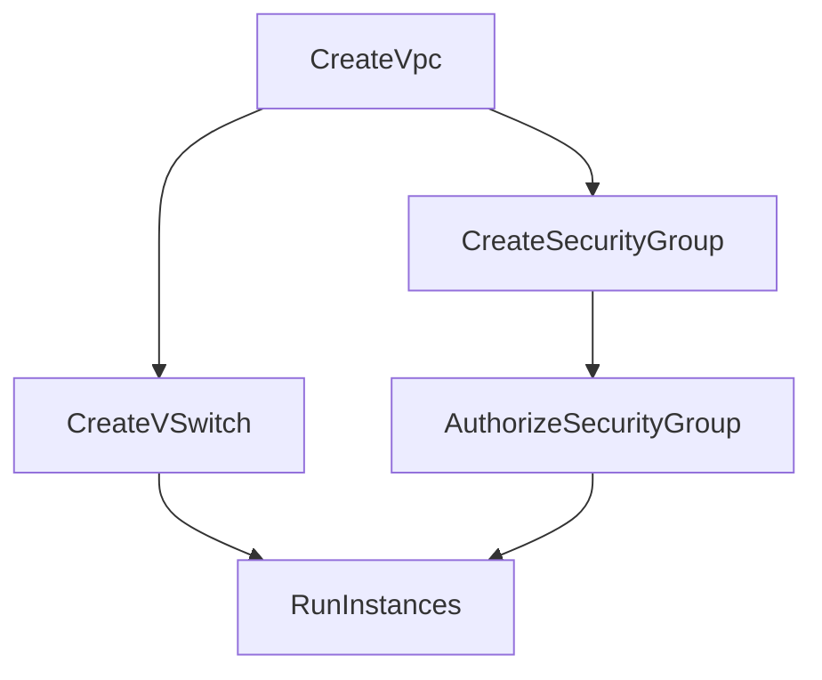
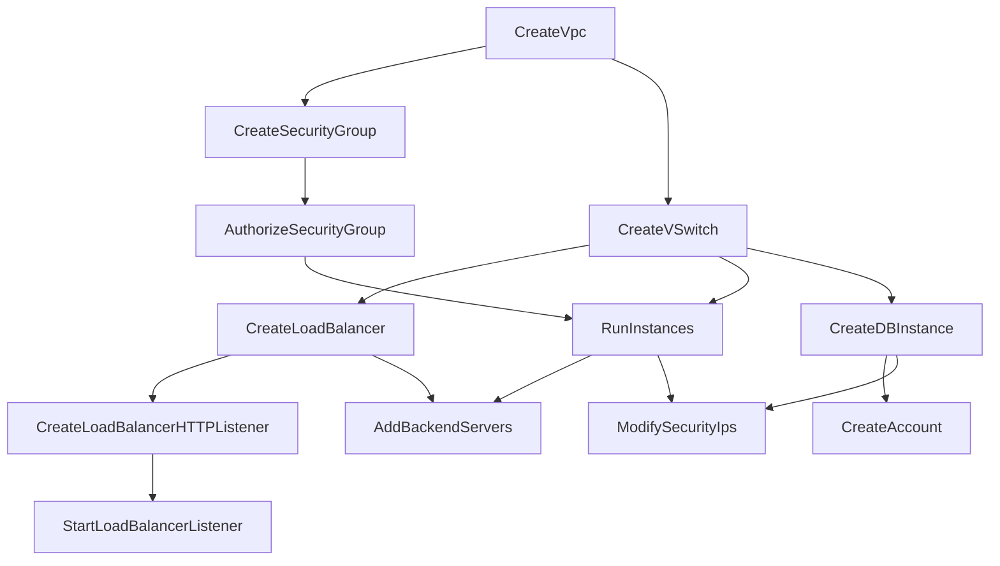
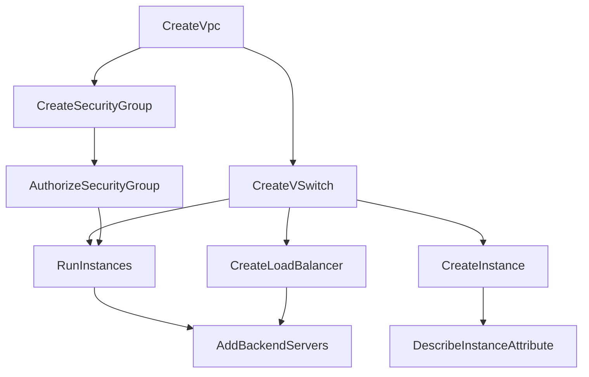

# Generated Poset Scenarios for Review

This document visualizes the Partial Order Sets (Posets) defined in the JSON files in this directory.
Modify the JSON files directly and run `python generate_scenarios.py` to update this report.

## Dual Zone ECS + SLB
**File:** `dual_zone_ecs_slb.json`

**Description:** High Availability: ECS instances in two zones with SLB.

### Mermaid Diagram


### Execution Layers
```text
Execution Layers (Parallel Groups):
Layer 0: CreateVpc
Layer 1: CreateSecurityGroup, CreateVSwitch
Layer 2: AuthorizeSecurityGroup, CreateLoadBalancer
Layer 3: RunInstances
Layer 4: AddBackendServers
```

---

## Dual Zone ECS + SLB + RDS
**File:** `dual_zone_ecs_slb_rds.json`

**Description:** Production HA: Dual zone ECS, SLB, and RDS HA.

### Mermaid Diagram


### Execution Layers
```text
Execution Layers (Parallel Groups):
Layer 0: CreateVpc
Layer 1: CreateSecurityGroup, CreateVSwitch
Layer 2: AuthorizeSecurityGroup, CreateLoadBalancer, CreateDBInstance
Layer 3: RunInstances, CreateAccount
Layer 4: AddBackendServers, ModifySecurityIps
```

---

## EIP + SLB + ECS
**File:** `eip_slb_ecs.json`

**Description:** Public Facing Web: EIP bound to SLB with ECS backend.

### Mermaid Diagram


### Execution Layers
```text
Execution Layers (Parallel Groups):
Layer 0: CreateVpc, AllocateEipAddress
Layer 1: CreateSecurityGroup, CreateVSwitch
Layer 2: AuthorizeSecurityGroup, CreateLoadBalancer
Layer 3: RunInstances, AssociateEipAddress
Layer 4: AddBackendServers
```

---

## Simple ECS
**File:** `simple_ecs.json`

**Description:** Deploys a VPC network and a single ECS instance.

### Mermaid Diagram


### Execution Layers
```text
Execution Layers (Parallel Groups):
Layer 0: CreateVpc
Layer 1: CreateSecurityGroup, CreateVSwitch
Layer 2: AuthorizeSecurityGroup
Layer 3: RunInstances
```

---

## SLB + ECS + RDS
**File:** `slb_ecs_rds.json`

**Description:** Full Stack: SLB load balancer, ECS application, and RDS database.

### Mermaid Diagram


### Execution Layers
```text
Execution Layers (Parallel Groups):
Layer 0: CreateVpc
Layer 1: CreateSecurityGroup, CreateVSwitch
Layer 2: AuthorizeSecurityGroup, CreateLoadBalancer, CreateDBInstance
Layer 3: CreateLoadBalancerHTTPListener, RunInstances, CreateAccount
Layer 4: AddBackendServers, StartLoadBalancerListener, ModifySecurityIps
```

---

## SLB + ECS + Redis
**File:** `slb_ecs_redis.json`

**Description:** Web App with Cache: SLB, ECS, and Redis.

### Mermaid Diagram


### Execution Layers
```text
Execution Layers (Parallel Groups):
Layer 0: CreateVpc
Layer 1: CreateSecurityGroup, CreateVSwitch
Layer 2: CreateInstance, AuthorizeSecurityGroup, CreateLoadBalancer
Layer 3: DescribeInstanceAttribute, RunInstances
Layer 4: AddBackendServers
```

---

